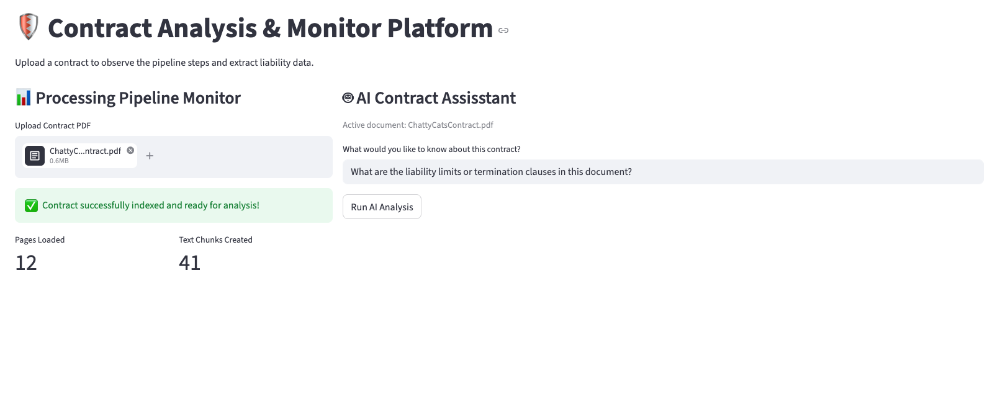

# Contract Analysis Monitor

A Streamlit app that ingests a contract PDF, builds a local vector index, and answers questions using Retrieval-Augmented Generation (RAG).

The app provides:
- A pipeline monitor (load -> chunk -> embed -> index)
- AI Q&A over uploaded contracts
- Retrieved source chunk inspection for traceability
- Preserves the original uploaded filename for the active document



## Tech Stack

- Streamlit (UI)
- LangChain LCEL (RAG chain composition)
- FAISS (vector store)
- Ollama Embeddings (`nomic-embed-text`)
- Ollama LLM (`llama3.2`)

## Project Structure

- `app.py` - Main Streamlit application
- `requirement.txt` - Python dependencies
- `.env` - Optional local environment variables
- `uploads/` - Temporary storage for the active uploaded PDF

## Prerequisites

1. Python 3.10+
2. Ollama installed and running
3. Required Ollama models pulled locally:

```bash
ollama pull nomic-embed-text
ollama pull llama3.2
```

## Setup

1. Clone the repository and enter the project folder.
2. Create and activate a virtual environment.

```bash
python3 -m venv .venv
source .venv/bin/activate
```

3. Install dependencies.

```bash
pip install -r requirement.txt
pip install langchain-ollama
```

## Run

```bash
streamlit run app.py
```

Open the URL shown in your terminal (usually `http://localhost:8501`).

## How to Use

1. Upload a contract PDF from the left panel.
2. Wait for ingestion and indexing to complete.
3. Enter a question in the right panel.
4. Click **Run AI Analysis**.
5. Expand **View Retrieved Contract Source Segments** to audit supporting chunks.
6. Check the active document caption in the right panel to confirm which PDF is being analyzed.

## Notes

- Processing and vector DB are stored in Streamlit session state.
- Uploading a new PDF in the same session may require refreshing/restarting to re-index cleanly.
- The app stores the current upload in `uploads/` using the original filename and removes older PDFs from that folder.

## Troubleshooting

- `TypeError: string indices must be integers`:
	This happens if code treats the LLM string output like a dictionary. Ensure source documents are read from the retriever output, not from the parsed text response.

- Ollama connection/model errors:
	- Make sure Ollama is running.
	- Verify models are available with `ollama list`.

- FAISS install issues on Apple Silicon:
	If `faiss-cpu` fails to install, install build tools and retry in a fresh virtual environment.

## Future Improvements

- Add multi-file upload and persistent document indexing
- Add structured extraction for liabilities/termination clauses
- Add exportable analysis reports
